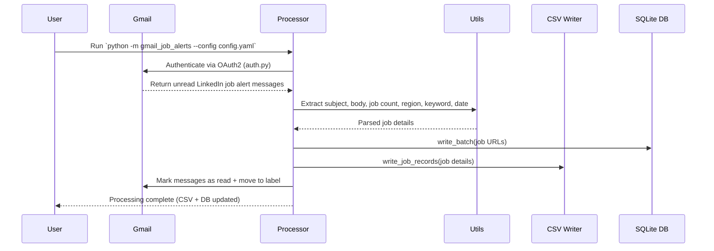

# Gmail Job Alerts 📬💼

Automate the processing of **LinkedIn job alert emails** directly from your Gmail inbox.  
This tool fetches unread job alert messages, extracts structured job information (keywords, regions, job counts, dates, and job URLs), and persists them for analysis.

---

## ✨ Features

- 🔑 **Gmail Authentication** via OAuth2 (secure token storage per account).
- 📥 **Fetch unread LinkedIn job alerts** from Gmail.
- 📝 **Parse job details**:
  - Keywords (e.g., "Python", "Data Engineer")
  - Regions / countries
  - Job counts
  - Email dates
  - LinkedIn job URLs
- 📂 **Persistence**:
  - Write structured job records to a CSV file.
  - Store LinkedIn job URLs in a local SQLite database.
- 🏷️ **Inbox management**:
  - Mark processed messages as read.
  - Move them into a predefined Gmail label.

---

## 🔄 Processing Flow



---

## 📦 Project Structure

```
gmail_job_alerts/
├── __init__.py        # Package entrypoint (exposes read_urls, delete_urls)
├── __main__.py        # CLI entrypoint: allows `python -m gmail_job_alerts`
├── auth.py            # Gmail OAuth2 authentication utilities
├── processor.py       # Core logic for processing LinkedIn job alerts
├── utils.py           # Helper functions for parsing and config loading
├── jobs_writer.py     # Write structured job records to CSV
├── urls_db.py         # SQLite-backed persistence for job URLs
└── config.yaml        # Example configuration file
```

---

## ⚙️ Installation

1. **Clone the repository**:

2. **Create a virtual environment** (recommended):
   ```bash
   python -m venv .venv
   source .venv/bin/activate   # Linux / macOS
   .venv\Scripts\activate      # Windows
   ```

3. **Install dependencies**:
   ```bash
   pip install -r requirements.txt
   ```

4. **Enable Gmail API**:
   - Go to [Google Cloud Console](https://console.cloud.google.com/).
   - Enable the Gmail API.
   - Download your `credentials.json` and place it in `gmail_job_alerts/`.

---

## 🛠️ Configuration

Create a YAML or JSON config file (e.g., `gmail_job_alerts/config.yaml`):

```yaml
csv_file_path: "jobs.csv"
email_timezone: "UTC"
accounts:
  personal: "LinkedInJobs"
keywords:
  - python
countries_or_regions:
  - Germany
```

- **csv_file_path**: Path to the CSV file where the new job records count will be written.
- **email_timezone**: Timezone for normalizing email dates.
- **accounts**: Mapping of account identifiers → Gmail label names.
- **keywords**: List of keywords to match in job alerts.
- **countries_or_regions**: List of regions to filter job alerts.

---

## 🚀 Usage

Run the processor as a module:

```bash
python -m gmail_job_alerts --config gmail_job_alerts/config.yaml
```

- On first run, a browser window will open for Google login and consent. Look for which account it's running see console
- Tokens are saved as `token_<account>.json` in the package directory.

---

## 📚 Public API

The package exposes only two database functions at the top level:

```python
from gmail_job_alerts import read_urls, delete_urls

# Read up to 10 stored job URLs
for url in read_urls(limit=10):
    print("Processing:", url)
    # ... do something ...
    delete_urls(url)  # remove after processing
```

---

## 🗄️ Data Persistence

- **CSV file**: Stores structured job records (keyword, region, job count, date).
- **SQLite database** (`gmail_job_alerts/urls.db`): Stores LinkedIn job URLs.
- **Log file** (`gmail_job_alerts/db_failures.log`): Records failed DB operations.

---

## 🧪 Development

- Run with debugging in VS Code by creating a `launch.json` with:
  ```json
  {
    "name": "Debug gmail_job_alerts",
    "type": "debugpy",
    "request": "launch",
    "module": "gmail_job_alerts",
    "args": ["--config", "gmail_job_alerts/config.yaml"],
    "console": "integratedTerminal"
  }
  ```

- Use breakpoints instead of `print` for easier debugging.

---

## ⚠️ Notes

- Gmail labels referenced in the config must already exist.
- Only LinkedIn job alert senders are supported:
  - `jobalerts-noreply@linkedin.com`
  - `jobs-noreply@linkedin.com`
- Requires Python 3.9+ (for `zoneinfo`).
